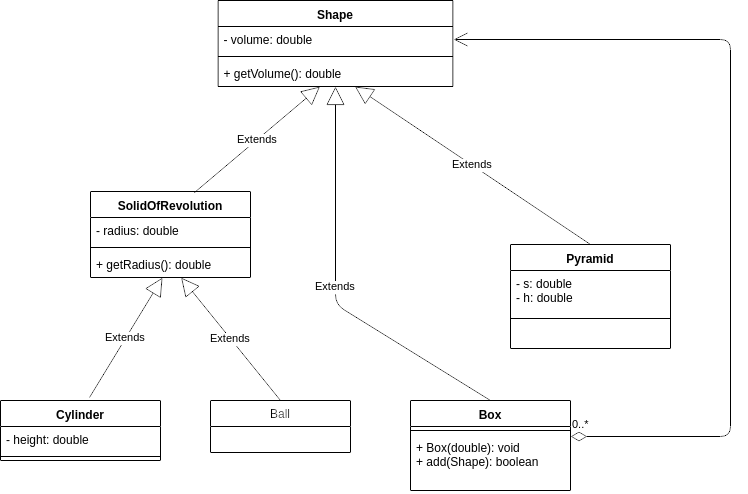

# Наследование 

4.0. Реализовать иерархию классов, описывающую трёхмерные фигуры

Задача
--------

Реализуйте иерархию классов:

Класс Box является контейнером, он можем содержать в себе другие фигуры. Метод add() принимает на вход Shape. Нужно добавлять новые фигуры до тех пор, пока для них хватаем места в Box (будем считать только объём, игнорируя форму. Допустим, мы переливаем жидкость). Если места для добавления новой фигуры не хватает, то метод должен вернуть false.

Решение:
--------

    class Shape {
        
        private double volume;
    
        public Shape(double volume) {
            this.volume = volume;
        }
    
        public double getVolume() {
            return volume;
        }
    }
    
    class SolidOfRevolution extends Shape {
    
        private double radius;
    
        public SolidOfRevolution(double volume, double radius) {
            super(volume);
            this.radius = radius;
        }
    
        public double getRadius() {
            return radius;
        }
    }
    
    class Ball extends SolidOfRevolution { // конкретный класс
        public Ball(double radius) {
            super(Math.PI * Math.pow(radius, 3) * 4 / 3, radius);
        }
    }
    
    class Cylinder extends SolidOfRevolution { // конкретный класс
        
        private double height;
    
        public Cylinder(double radius, double height) {
            super(Math.PI * radius * radius * height, radius);
            this.height = height;
        }
    }
    
    class Pyramid extends Shape{
        
        private double height;
        private double s; // площадь основания
    
        public Pyramid(double height, double s) {
            super(height * s * 4 / 3);
            this.height = height;
            this.s = s;
        }
    }
    
    
    class Box extends Shape {

        private ArrayList<Shape> shapes = new ArrayList<>();
        private double available;
    
        public Box(double available) {
            super(available);
            this.available = available;
        }
    
        public boolean add(Shape shape) {
            if (available >= shape.getVolume()) {
                shapes.add(shape);
                available -= shape.getVolume();
                return true;
            } else {
                return false;
            }
        }
    }
    
    public class Main {
    
        public static void main(String[] args) {
            Ball ball = new Ball(4.5);
            Cylinder cylyinder = new Cylinder(2, 2);
            Pyramid pyramid = new Pyramid(100, 100);
    
            Box box = new Box(1000);
    
            System.out.println(box.add(ball)); // ok
            System.out.println(box.add(cylyinder)); // ok
            System.out.println(box.add(pyramid)); // failed
        }
    }

4.1. Реализовать иерархию классов, описывающую трёхмерные фигуры — 2
----

Задача:
----

Реализуйте ту же иерархию классов, но сделав некоторые классы абстрактными.

Решение:
----

    abstract class Shape {
    public abstract double getVolume();
    }
    
    abstract class SolidOfRevolution extends Shape {
    protected double radius;
    
        public SolidOfRevolution(double radius) {
            this.radius = radius;
        }
    
        public double getRadius() {
            return radius;
        }
    }
    
    class Ball extends SolidOfRevolution { // конкретный класс
    
        @Override
        public double getVolume() {
            return Math.PI * Math.pow(radius, 3) * 4 / 3;
        }
    
        public Ball(double radius) {
            super(radius);
        }
    }
    
    class Cylinder extends SolidOfRevolution { // конкретный класс
    private double height;
    
        public Cylinder(double radius, double height) {
            super(radius);
            this.height = height;
        }
    
        @Override
        public double getVolume() {
            return Math.PI * radius * radius * height;
        }
    }
    
    class Pyramid extends Shape {
    private double height;
    private double s; // площадь основания
    
        public Pyramid(double height, double s) {
            this.height = height;
            this.s = s;
        }
    
        @Override
        public double getVolume() {
            return height * s * 4 / 3;
        }
    }
    
    
    class Box extends Shape {
    private ArrayList<Shape> shapes = new ArrayList<>();
    private double available;
    private double volume;
    
        public Box(double available) {
            this.available = available;
            this.volume = available;
        }
    
        public boolean add(Shape shape) {
            if (available >= shape.getVolume()) {
                shapes.add(shape);
                available -= shape.getVolume();
                return true;
            } else {
                return false;
            }
        }
    
        @Override
        public double getVolume() {
            return volume;
        }
    }
    
    public class Main {
    
        public static void main(String[] args) {
            Ball ball = new Ball(4.5);
            Cylinder cylyinder = new Cylinder(2, 2);
            Pyramid pyramid = new Pyramid(100, 100);
    
            Box box = new Box(1000);
    
            System.out.println(box.add(ball)); // ok
            System.out.println(box.add(cylyinder)); // ok
            System.out.println(box.add(pyramid)); // failed
    
        }
    }

4.2. Реализовать иерархию классов, описывающую трёхмерные фигуры — 3
----

Задача:
----

Реализуйте ту же иерархию классов, но использовав интерфейсы.
Дополнительно, студентам предлагается реализовать интерфейс Comparable.

Решение:
----

    interface Shape extends Comparable<Shape>{
    double getVolume();
    
        @Override
        default int compareTo(Shape other) {
            return Double.compare(getVolume(), other.getVolume());
        }
    }
    
    abstract class SolidOfRevolution implements Shape {
    protected double radius;
    
        public SolidOfRevolution(double radius) {
            this.radius = radius;
        }
    
        public double getRadius() {
            return radius;
        }
    }
    
    class Ball extends SolidOfRevolution { // конкретный класс
    
        @Override
        public double getVolume() {
            return Math.PI * Math.pow(radius, 3) * 4 / 3;
        }
    
        public Ball(double radius) {
            super(radius);
        }
    }
    
    class Cylinder extends SolidOfRevolution { // конкретный класс
    
        private double height;
    
        public Cylinder(double radius, double height) {
            super(radius);
            this.height = height;
        }
    
        @Override
        public double getVolume() {
            return Math.PI * radius * radius * height;
        }
    }
    
    class Pyramid implements Shape {
    private double height;
    private double s; // площадь основания
    
        public Pyramid(double height, double s) {
            this.height = height;
            this.s = s;
        }
    
        @Override
        public double getVolume() {
            return height * s * 4 / 3;
        }
    }
    
    
    class Box implements Shape {
    private ArrayList<Shape> shapes = new ArrayList<>();
    private double available;
    private double volume;
    
        public Box(double available) {
            this.available = available;
            this.volume = available;
        }
    
        public boolean add(Shape shape) {
            if (available >= shape.getVolume()) {
                shapes.add(shape);
                available -= shape.getVolume();
                return true;
            } else {
                return false;
            }
        }
    
        @Override
        public double getVolume() {
            return volume;
        }
    
        public ArrayList<Shape> getShapes() {
            return shapes;
        }
    }
    
    public class Main {
    
        public static void main(String[] args) {
            Ball ball = new Ball(4.5);
            Cylinder cylyinder = new Cylinder(2, 2);
            Pyramid pyramid = new Pyramid(100, 100);
    
            Box box = new Box(1000);
    
            System.out.println(box.add(ball)); // ok
            System.out.println(box.add(cylyinder)); // ok
            System.out.println(box.add(pyramid)); // failed
    
            // Sorting:
            ArrayList<Shape> shapes = box.getShapes();
            Collections.sort(shapes); // sorted by Volume!
        }
    }

4.3. Реализовать иерархию классов, описывающую трёхмерные фигуры — 4
-----

Задача:
-----

Добавьте в иерархию классов фигуру вращения для произвольной функции. Вычислять объём можно приближенное с помощью определённого интеграла. Так как объём фигуры вращения вокруг оси x это
$V_x = \pi\int_{a}^{b} f^2(x)dx$

А интеграл это
image

То можно написать реализацию метода прямоугольников:

    class SolidRevolutionForFunction extends SolidOfRevolution {
    private Function<Double, Double> function;
    private double a;
    private double b;
    
        public SolidRevolutionForFunction(
                               Function<Double, Double> function, double a, double b) {
            super(b - a);
            this.function = function;
            this.a = a;
            this.b = b;
        }
    
        @Override
        public double getVolume() {
            double sum = 0;
            int iterations = 10000;
            double delta = (b - a)/iterations;
            for(int i = 0; i < iterations; i++){
                double x = a + ((b - a) * i/iterations);
                sum += Math.pow(function.apply(x), 2) * delta;
            }
            return Math.PI * sum;
        }
    }
    
    public static void main(String[] args) {
    Shape shape = new SolidRevolutionForFunction(new Function<Double, Double>() {
    @Override
    public Double apply(Double x) {
    return Math.cos(x);
    }
    }, 0, 10);
    System.out.println(shape.getVolume());
    }

Конечно, мы не учитываем точность вычислений здесь, и не подбираем количество разбиений для достижения необходимой точности, но это задача на программирование, а не численные методы, так что на занятиях мы это опускаем.